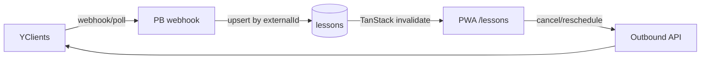

# YClients ↔ Квартира

Двусторонняя синхронизация записи на занятия. В приложении **нет** мастера `/lessons/book` — запись только через YClients; `/lessons` показывает уже существующие занятия (после sync).

## Статус

| Часть | Статус |
|-------|--------|
| UI записи в приложении | Убрана (redirect `/lessons/book` → `/lessons`) |
| Поля `externalSource` / `externalId` на `lessons` и `users` | Миграция `1792500000_*` |
| Порт `YClientsSyncPort` + `NullYClientsSync` | `src/services/integrations/yclients/` |
| Webhook stub | `POST /api/kvartira/yclients/webhook` (501 без секрета) |
| Живой API YClients | Не подключён — нужны credentials |

## Env

```bash
YCLIENTS_COMPANY_ID=
YCLIENTS_TOKEN=
YCLIENTS_WEBHOOK_SECRET=
```

Пустой `YCLIENTS_WEBHOOK_SECRET` → sync выключен (webhook отвечает `501 YCLIENTS_DISABLED`).

## Маппинг пользователей

Клиент YClients ↔ пользователь приложения:

1. Предпочтительно `users.externalId` + `externalSource=yclients` после ручной/скриптовой привязки.
2. Fallback: телефон (`users.phone` в формате `+7…` ↔ телефон клиента в YClients).
3. Преподаватель: staff id YClients → `users.externalId` у роли teacher/admin.

## Потоки (будущее)



### Inbound

1. YClients событие (создана/изменена/отменена запись).
2. Webhook с `X-YClients-Secret` → `kvartiraYclients.handleWebhookPayload`.
3. `upsertLessonFromExternal` по `(externalSource, externalId)`.
4. Realtime / invalidate `['lessons']` как у обычных занятий.

### Outbound

1. Пользователь переносит/отменяет в `LessonDetailPage` (пока локально в PB).
2. После live sync: вызов YClients API → confirm → обновление PB.
3. `LessonsApi.bookLesson` остаётся в контракте для тестов/mock; UI не вызывает.

## Деплой

1. Миграция `1792500000_kvartira_yclients_external_ids.js`.
2. `pb_hooks/yclients.pb.js` + `lib/kvartiraYclients.js`.
3. Перезапуск PocketBase.
4. Задать `YCLIENTS_*` на сервере, когда будете включать live sync.
